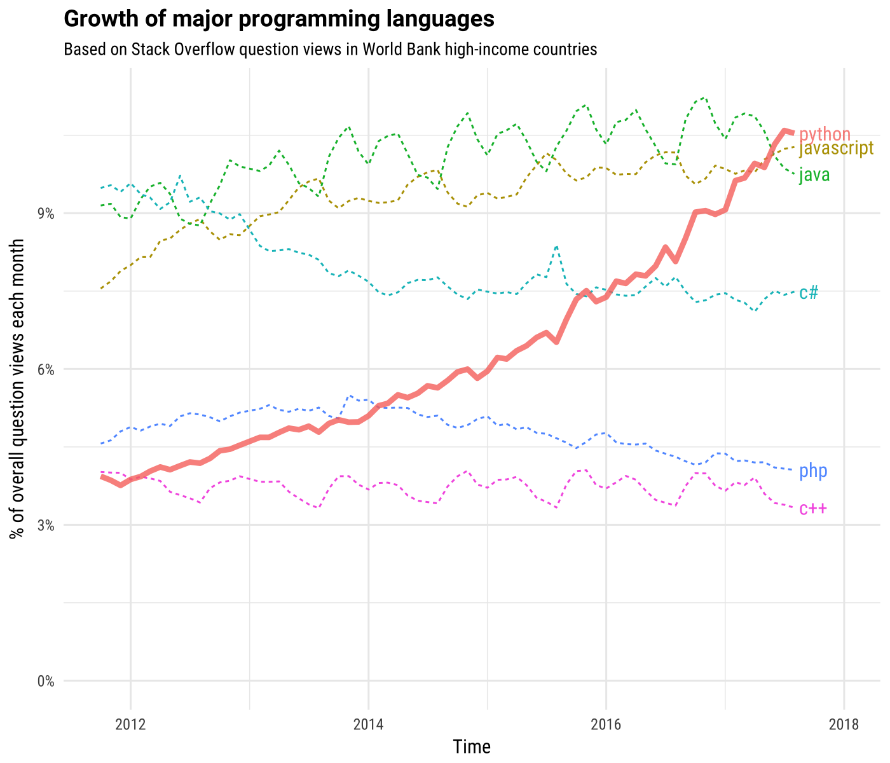

---
jupyter:
  jupytext:
    text_representation:
      extension: .Rmd
      format_name: rmarkdown
      format_version: '1.0'
      jupytext_version: 1.0.5
  kernelspec:
    display_name: Python 3
    language: python
    name: python3
---

# Data Science - Hands on!

O minicurso apresenta, na prática, o dia-a-dia de cientistas de dados na Accenture - uma das empresas que mais atua na área de Applied Intelligence. 

Será abordado desde análise exploratória até aplicações diretas de machine learning utilizando Python.


# Ciência de dados

<hr>
<p style='font-size:30px; margin: auto; width: 80%; font-weight: bold;'> "Before anything else, there is always data" </p>


https://www.kdnuggets.com/2018/06/what-where-how-data-science.html


## Intro

Ciência de dados é um termo popular que atualmente possui uma definição extremamente **abrangente**.

Seus métodos, objetivos e aplicações - **evoluem com o tempo e com a tecnologia**.

Ciência de dados há alguns anos se referia a limpeza de bases de dados, transformações e análises estatísticas.
Atualmente, inclui:
* Mineração de dados
* Análise de dados
* Estatística
* Modelagem Preditiva
* Modelagem Prescritiva 
* Machine Learning
* Deep Learning 
* Processamento de linguagem natural
* Aprendizado por reforço
* Business Intelligence?! *
* Infraestrutura Cloud *
* Desenvolvimento web/apps para aplicações com machine learning*
* ...

<p style="font-size:12px">*Áreas que suportam a ciência de dados no dia-a-dia</p>

<p style="font-size:20px">Tudo isso utilizando **diferentes** ferramentas, linguagens de programação, técnicas, etc.</p>


https://www.houseofbots.com/news-detail/11772-1-three-types-of-analytics-to-get-you-started-with-big-data-analytics


## Carreiras

* Cientista de dados
* Analista de dados
* Arquiteto de dados
* Engenheiro de dados
* Estatístico
* Administrador Cloud/DB
* Business analyst
* Data and Analytics Manager


https://www.kdnuggets.com/2015/11/different-data-science-roles-industry.html


*Muitas carreiras tem overlap e nem todas as empresas adotam/contratam para todas as funções*


## Por onde começar?!


Focaremos neste minicurso em **Análise exploratória e modelagem preditiva** utilizando **Python**.


<p style="font-size:20px;"> The Incredible Growth of Python</p>

"*Python is the most wanted language for the second year in a row, meaning that it is the language that developers who do not yet use it most often say they want to learn.*", https://insights.stackoverflow.com/survey/2018/


https://stackoverflow.blog/2017/09/06/incredible-growth-python


## Possibilidades, Projetos, abordagens e dia-a-dia

* Google Deep Mind: https://deepmind.com/research/alphago/


<hr>
* OpenAI: Dota2 team https://blog.openai.com/openai-five/


<hr>
* Gapso/Accenture - Previsão de internação de pacientes no Pronto atendimento


<ul>
    <li>https://epocanegocios.globo.com/Tecnologia/noticia/2019/04/tecnologia-para-gestao-de-leitos-diminui-tempo-de-internacao-no-hospital-albert-einstein.html</li>
    <li>http://gehosp.com.br/2019/04/13/tecnologia-leitos-internacao/</li>
    <li>https://g1.globo.com/olha-que-legal/especial-publicitario/einstein-e-sua-saude/noticia/2019/06/25/hospital-israelita-albert-einstein-inaugura-centro-de-excelencia-em-intervencao-cardiaca.ghtml</li>
    <li>https://saudebusiness.com/ti-e-inovacao/albert-einstein-renova-infraestrutura-de-ti/</li>
</ul>

<hr>
* Gapso/Accenture - Previsão de falhas em equipamentos


<hr>
* Gapso/Accenture - Monitoramento de mídias sociais com 2 milhoes de msgs/dia. NLP, Análise de sentimento, Tópicos e temas, Spam, ..


## Enfim, como é o dia-a-dia?


https://en.wikipedia.org/wiki/Cross-industry_standard_process_for_data_mining


## Bibliotecas mais utilizadas


https://www.datasciencecentral.com/profiles/blogs/top-20-python-libraries-for-data-science-in-2018


## Básico jupyter notebook

* CTRL + Enter - executa célula
* SHIFT + Enter - executa célula e passa para a célula seguinte
* Alt + Enter - executa célula e abre uma nova célula abaixo
  
* ESC - Tira seleção da célula
* a - Cria célula acima
* b - Cria célula abaixo
* dd - Deleta célula
* z - Undo


# Análise exploratória

* Quais as hipóteses? - curiosidade, conhecimento de negócio
* Quem é o público que irá assistir/ler a apresentação dos resultados? (cliente técnico, business, investidor, seu gerente, setor criativo, stakeholders, outros funcionários que já conhecem o código?)
* Como serão utilizados os resultados? (Decisão de negócio, investimento, informativo, ..)
* Quais questões o seu público irá ter? (Filtros por segmentos, contexto, tendências, ..)
* Qual o melhor storytelling? Priorizacao de hipóteses
* Premissas? Teve algum embasamento? Qual a opinião das pessoas de negócio? 
* Quem deve poder acessar a informação? Confidencialidade/segurança

Adaptado: https://towardsdatascience.com/20-questions-to-ask-prior-to-starting-data-analysis-6ec11d6a504b


## Churn

"A taxa de <a href="https://en.wikipedia.org/wiki/Churn_rate">churn</a>, no seu sentido mais amplo, é uma medida do número de indivíduos ou itens que saem de um grupo coletivo durante um período específico."

Exemplos de churn:
* Clientes
* Receita
* Funcionários

No caso de churn de clientes, a análise é feita sobre qual e quando um cliente irá parar de comprar.
Para funcionários a ideia é similar, realizando a previsão de quem e quando irá sair da empresa.


## Business problem
<hr>

Saída de funcionários é um custo alto por conta de busca por novos talentos que toma tempo, retreinamentos de novos funcionários, falta de mão de obra durante momentos críticos e perda de produtividade. Por isso, o cliente precisa de:

Data Science view:
* Aumentar retenção de funcionários
* Criar novos programas de incentivo ao funcionário
* Melhorar qualidade do dia-a-dia e expectativa dos funcionários em relação à empresa

* Análise de churn de funcionários para entender o motivo e aprender as características mais relevantes dos funcionários "fiéis" e dos que deixam a empresa
* Criar modelos de previsão de saída de funcionários


Tutorial rápido pandas: https://pandas.pydata.org/pandas-docs/stable/10min.html


### 1. Import de Bibliotecas

```{python}
import pandas as pd              # estrutura de dados: dataframes
import matplotlib.pyplot as plt  # para gerar gráficos
import seaborn as sns            # graficos mais complexos
# %matplotlib inline
```

```{python}
# Carrega base de dados em formato CSV (Comma-separated values)
dados = pd.read_csv('HR_comma_sep.csv', sep=',')
```

```{python}
dados.columns
```

```{python}
dados.shape
```

```{python}
# Visualiza 5 primeiras linhas do dataframe
# Cada funcionário em uma linha e característica (feature) em colunas
dados.head(5)     #.tail()
```

```{python}
dados.columns = [coluna.strip() for coluna in dados.columns]
```

```{python}
dados.columns
```

* **satisfaction_level**: *nível de satisfação do funcionário. Varia de 0 a 1.*
* **last_evaluation**: *avaliação de performance do funcionário. Varia de 0 a 1.*
* **number_projects**: *De quantos projetos o funcionário participa?*
* **average_monthly_hours**: *Quantas horas em média de trabalho para aquele funcionário por mês?*
* **time_spent_company**: *experiência (anos) do funcionário na empresa*
* **work_accident**: *se o funcionário teve um acidente de trabalho ou não*
* **promotion_last_5years**: *se o funcionário foi promovido nos últimos 5 anos ou não*
* **Departments**: *departamento em que o funcionário trabalha*
* **salary**: *Níveis de salário: low, medium and high.*
* **left**: *se o funcionário saiu da empresa ou não*


# Hipóteses

```{python}
# tipos dos dados
dados.dtypes
```

```{python}
dados.head().T
```

```{python}
# acesso a cada coluna 
dados['satisfaction_level'].head()   #ou dados.satisfaction_level
```

```{python}
# acesso a mais de uma coluna
dados[['satisfaction_level', 'salary']].head()
```

```{python}
# ordenacao
dados.sort_values(by='time_spend_company', ascending=False).head()
```

```{python}
# ordenacao de mais de uma coluna
# Top 5 insatisfeitos em muitos projetos
galera_insatisfeita = dados.sort_values(by=['satisfaction_level', 'number_project'], ascending=[True, False]).head()
galera_insatisfeita
```

```{python}
galera_insatisfeita.index
```

```{python}
dados.loc[galera_insatisfeita.index, "Promover"] = True
```

```{python}
# selecao Top 5 insatisfeitos em muitos projetos
dados.loc[galera_insatisfeita.index]
```

```{python}
dados.head()
```

```{python}
# Preencher dados faltantes
dados.Promover.fillna(False, inplace=True)

dados.head()
```

```{python}
# filtrar dados
media_hrs_trabalhadas = dados['average_montly_hours'].mean()

print("Media de horas trabalhadas: "+str(media_hrs_trabalhadas))
dados_filtrados = dados[dados.average_montly_hours < media_hrs_trabalhadas]   # & (dados.promotion_last_5years)
dados_filtrados.head()
```

```{python}
# Visualizar estatísticas básicas de cada funcionário 
dados.describe(percentiles=[.25, .75, .9, .95])
```

```{python}
# estatisticas individuais
dados.satisfaction_level.median()
```

```{python}
# Verifica dados nulos
dados.isna().sum()
```

Os dados estão em um bom formato, não possuem colunas com valores nulos e existe uma boa quantidade de amostras. Em torno de 15mil

E agora.. Realmente existe um problema de Churn?

```{python}
# contagem de funcionarios que sairam/ficaram
print(dados.left.value_counts())        #.value_counts(normalize=True).plot.pie(figsize=(5,5), autopct='%.2f%%')
dados.left.value_counts(normalize=True).plot.pie(figsize=(5,5), autopct='%.2f%%')
```

```{python}
# Agrupar quem Saiu da empresa (churn) ou nao
dados.groupby('left').mean()    #.style.background_gradient(cmap='Wistia')
```

# Data visualization
## Histograma - Nível de satisfação 

```{python}
dados.satisfaction_level.hist(bins=20, figsize=(8, 5))

_ = plt.title('Histograma do Nível de Satisfação dos funcionários')
```

```{python}
# Filtra dados
nivel_left = dados.query('left==1')['satisfaction_level']
nivel_stay = dados.query('left==0')['satisfaction_level']

# Cria figura
fig, ax = plt.subplots(1, figsize=(8, 5))

# Monta e plota histograma
ax.hist([nivel_left, nivel_stay], 
        stacked=True, 
        alpha=.8, 
        bins=20, 
        label=['Left', 'Stayed'])

plt.title('Histograma do Nível de Satisfação dos funcionários - Churn')
_ = plt.legend()
```

## Distribuição de funcionários por departamento

```{python}
dados.Departments.value_counts(normalize=False).plot.barh()
```

```{python}
#dados[dados.left == 1].Departments.value_counts(normalize=False).sort_values(ascending=False).plot.barh()
dados.groupby('Departments').left.mean().sort_values(ascending=False).plot.barh()
```

```{python}
dados.groupby('Departments').left.value_counts().unstack('left').sort_values(by=0).plot.barh(stacked=True)
```

## Nível de satisfação relacionado com última avaliação do funcionário

```{python}
dados['cores'] = dados.left.map({1: 'darkred', 0: 'blue'})
dados[['left','cores']].drop_duplicates()
```

```{python}
dados.plot.scatter(x='satisfaction_level', y='last_evaluation', figsize=(8, 5), color=dados.cores)
```

## Dados quanto ao salário relacionado ao churn

```{python}
dados.groupby('left').salary.value_counts().unstack('salary').plot.bar(stacked=True)
```

## Work accident

```{python}
dados[dados.Work_accident.astype(bool)].Departments.value_counts(normalize=True).plot.barh()
```

## Criacao de novas *features*

```{python}
dados['MediaHrsProjeto'] = dados.average_montly_hours / dados.number_project
```

```{python}
dados.groupby('left').MediaHrsProjeto.describe().style.background_gradient(cmap='Wistia')
```

## Perfil dos funcionários

```{python}
dados.time_spend_company.value_counts(normalize=False).sort_index().plot.bar(figsize=(8, 5))

plt.title('Perfil de experiencia dos funcionários na empresa')
plt.xlabel('Anos de experiencia')
_ = plt.ylabel('#Qtd')
```

```{python}

```

```{python}
sns.countplot(x='time_spend_company', hue='left', data=dados)
```

## Outros tipos de graficos..

```{python}
dados.boxplot('satisfaction_level', 'number_project')
```

```{python}
dados['Churn'] = dados.left.map({1:'Churn', 0: 'Stayed'})
dados.boxplot('satisfaction_level', ['Churn', 'number_project'], figsize=(13, 4))
```

## Correlação

```{python}
correlacao = dados.corr()
```

```{python}
fig, ax = plt.subplots(figsize=(10, 8))
dados.columns = dados.columns.str.upper()

sns.heatmap(correlacao, annot=True)
```

```{python}

```
